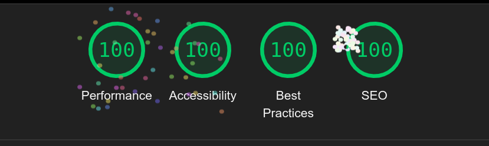

## Designidee
Das Design basiert auf der Idee des Scrollens. Jedes Mal, wenn du auf der Y-Achse scrollst und sich der Wert von scrollY in JavaScript ändert, bewegen sich die Designelemente, angefangen vom Himmel, über den Mond, die Berge, das Boot usw. Das Design wechselt auch zwischen Tag und Nacht, basierend auf der Position des Mondes im Design.

## Technologies

- HTML
- CSS
- JavaScript
- Git

## Meta Description Implementierung

Um die Sichtbarkeit unserer Website in Suchmaschinen zu verbessern und prägnante Zusammenfassungen unserer Inhalte bereitzustellen, haben wir Meta-Beschreibungen zu allen Seiten hinzugefügt. Dies stellt sicher, dass unsere Seiten korrekt indexiert und in den Suchergebnissen angezeigt werden.

